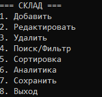
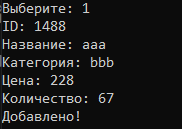

# Автоматизация учёта товаров на складе

# Сведения об авторе:
# ФИО:
Крылов Никита Александрович
# Учебная группа:
9КС-392
# Применяемый стандарт оформления: 
Google C++ Style Guide
# Цель лабораторной работы:
Совершенствование практических умений в области объектно-ориентированного проектирования, использования компонентов STL, организации файлового ввода-вывода, создания модульных программных комплексов и корректной обработки пользовательских данных в среде C++.
# Содержание задания:
Разработать консольную утилиту для автоматизации складского учёта. Создаваемое ПО должно поддерживать функции внесения новых позиций, изменения и удаления существующих записей, а также предоставлять механизмы поиска с фильтрацией, упорядочивания списка, вычисления статистических параметров и экспорта/импорта информации в текстовые файлы (TXT).
# Технические условия:
Язык реализации: C++ версии 17 или новее
Компилятор: произвольный
Контейнеры для хранения в оперативной памяти: std::vector либо std::list
Тип файла для сохранения: TXT с использованием символов-разделителей
Обработка некорректного ввода: предотвращение аварийного падения; допускается вариант с принудительным завершением работы (с потерей 2 баллов)
Оформление исходного кода: следование выбранному официальному гайдлайну
# Руководство по сборке:
Запустить командную строку разработчика Visual Studio 2022
Перейти в директорию с исходными файлами проекта через терминал
Выполнить команду: cl /std:c++17 /EHsc /Fe:warehouse_app.exe src\main.cpp src\Warehouse.cpp src\FileIO.cpp src\Menu.cpp
# Итоговая структура каталога (после компиляции):
WarehouseApp/
├── src/
│   ├── main.cpp
│   ├── Warehouse.h/.cpp
│   ├── 
├── data/
│   └── products.txt
├── FileIO.obj
├── main.obj
├── Menu.obj
├── Warehouse.obj
├── warehouse_app.exe
└── README.md

## Скриншоты работы:

